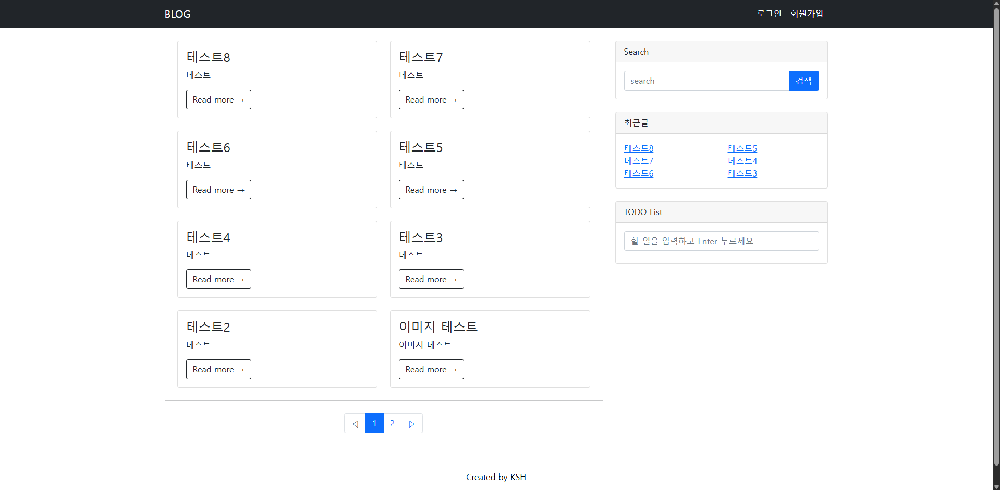
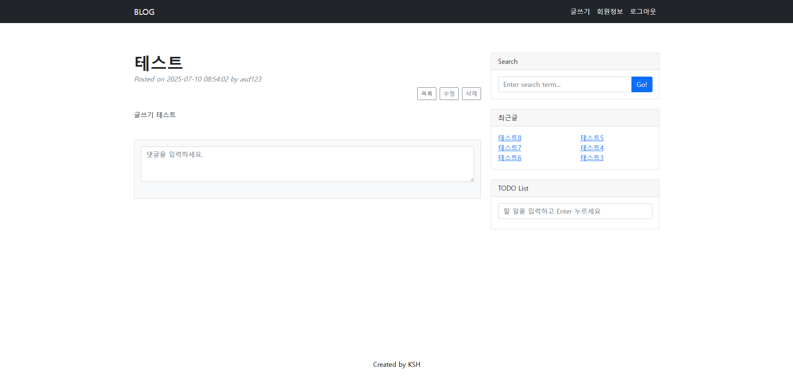
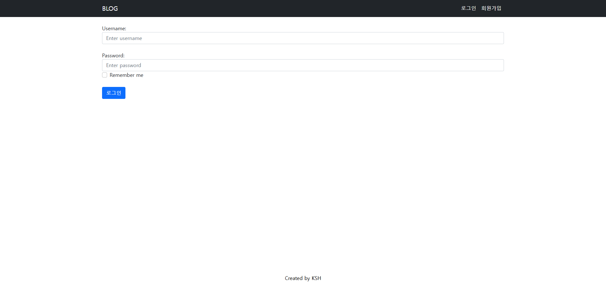

# 📝 Spring Boot Blog Project

> Spring Boot 기반의 개인 블로그 프로젝트입니다.  
> 게시글 작성, 댓글 기능, 사용자 인증 및 검색 기능을 포함한 **간단한 커뮤니티 플랫폼**을 구현했습니다.  
> Docker 및 Render를 활용한 **배포 환경 구성**까지 완료되었습니다.

---

## 🔧 기술 스택

### 📌 Back-end
- Java 17
- Spring Boot
- Spring Security
- JPA + QueryDSL
- Hibernate Validator
- PostgreSQL (Docker)
- REST API

### 🖥 Front-end
- Thymeleaf
- HTML / CSS / Bootstrap
- jQuery + Summernote

### ⚙️ DevOps & 배포
- Gradle
- Docker, Docker Compose
- Render.com (무료 배포 플랫폼)

---

## 🧩 주요 기능

| 기능 | 설명 |
|------|------|
| 🔐 회원가입 / 로그인 | Spring Security 적용, 세션 기반 인증 |
| ✏️ 게시글 CRUD | 제목/내용 입력, 작성자만 수정 및 삭제 가능 |
| 💬 댓글 기능 | 로그인 사용자만 댓글 작성 및 삭제 가능 |
| 🔎 검색 기능 | QueryDSL을 활용한 키워드 기반 게시글 검색 |
| 📄 페이징 처리 | 게시글 목록에 페이징 적용 |
| 📦 Docker 배포 | PostgreSQL + Spring Boot 앱 컨테이너 구성 |

---

## 🖼️ 주요 화면

| 메인 페이지                                            | 
|---------------------------------------------------|
|  | 
| 게시글 상세 |
|  |
| 로그인 |
|  |

---
## 🗂️ 디렉토리 구조

src
├── config              # Spring Security, QueryDSL 설정
├── controller          # API 및 뷰 컨트롤러
├── dto                 # 데이터 전송 객체
├── entity              # JPA 엔티티 (User, Board, Reply 등)
├── repository          # JPA + QueryDSL
├── service             # 비즈니스 로직
├── static              # JS, CSS, 이미지
└── templates           # Thymeleaf HTML 템플릿

---
## 🚀 배포
주소 : https://blog-15ov.onrender.com/ 

Render 설정
- PostgreSQL Add-on 사용
- Environment Variables 설정
- Dockerfile + docker-compose.yml 사용

---
## 📌 후기 및 개선점
Spring Security의 인증 흐름을 실전에서 경험할 수 있었습니다.

QueryDSL을 통한 동적 검색 구현이 인상 깊었고, 프론트 연동까지도 구현했습니다.

추후에는 파일 업로드 및 S3 저장소 연동, OAuth2 로그인 기능을 추가해보고 싶습니다.

