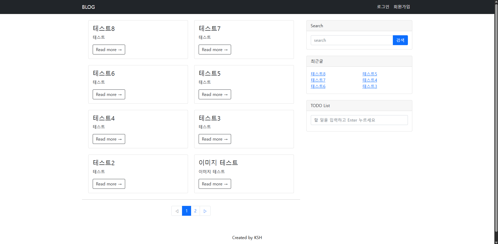
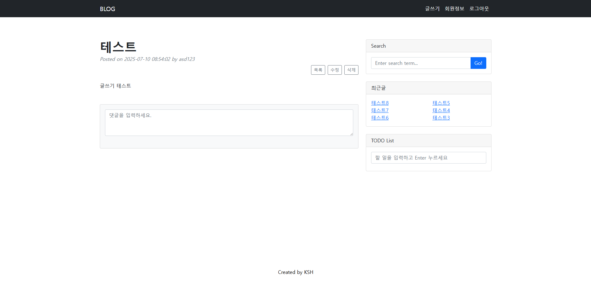
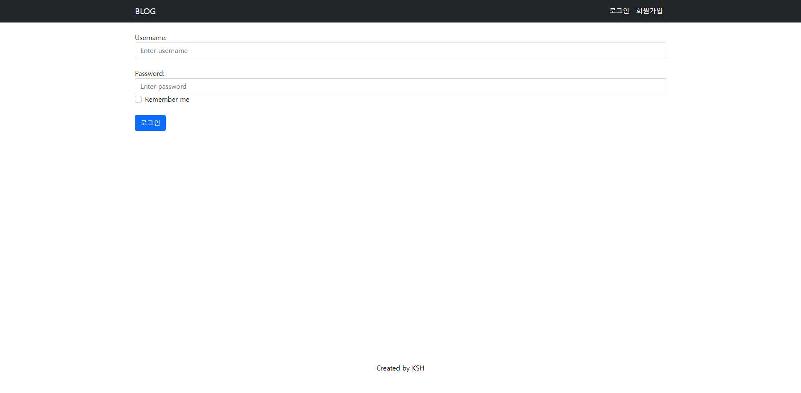

# 블로그 프로젝트

Spring Boot 기반의 블로그 웹 애플리케이션입니다.  
사용자는 게시글을 작성하고 댓글을 등록할 수 있으며, 검색 및 페이징 기능을 통해 게시글을 효율적으로 조회할 수 있습니다.

또한 Spring Security 기반 인증/인가 처리와 Docker + Render 배포 환경까지 구성했습니다.

---

## 배포 링크

🔗 https://blog-15ov.onrender.com/

---

## 프로젝트 소개

Spring Boot와 JPA 기반으로 구현한 블로그 프로젝트입니다.

단순 CRUD 구현이 아닌 실제 서비스 구조를 고려하여 다음 기능들을 중심으로 개발했습니다.

- Spring Security 기반 인증/인가 처리
- QueryDSL 기반 동적 검색
- Ajax 기반 댓글 처리
- Validation 기반 입력값 검증
- Docker 기반 배포 환경 구성
- Summernote 기반 게시글 작성 에디터 적용

---

##  기술 스택

| 구분 | 기술 |
|------|------|
| Language | Java 17 |
| Framework | Spring Boot, Spring Security |
| ORM | Spring Data JPA, QueryDSL |
| Database | PostgreSQL, H2 |
| Front-end | Thymeleaf, Bootstrap, jQuery, Summernote |
| Validation | Hibernate Validator |
| Deployment | Docker, Docker Compose, Render |
| Build Tool | Gradle |

---

## 주요 기능

###  회원 기능

- 회원가입 / 로그인 / 로그아웃
- Spring Security 기반 인증 및 인가 처리
- 회원가입 유효성 검증 및 에러 메시지 출력
- BCrypt 비밀번호 암호화 저장

---

### 게시글 기능

- 게시글 작성 / 수정 / 삭제
- 작성자 권한 검증 처리
- Summernote 기반 게시글 작성
- 게시글 상세 조회 기능

---

### 댓글 기능

- Ajax 기반 댓글 등록 및 삭제
- 로그인 사용자만 댓글 작성 가능
- 본인 작성 댓글만 삭제 가능

---

### 검색 및 페이징

- QueryDSL 기반 동적 검색
- 제목 및 내용 기반 키워드 검색
- Pageable 기반 페이징 처리

---

### 배포 환경

- Docker 및 Docker Compose 환경 구성
- PostgreSQL 컨테이너 구성
- Render 기반 배포 환경 적용

---

## ⚙️ 핵심 기술 구현

### Spring Security 인증/인가

- 세션 기반 로그인 처리
- 권한에 따른 접근 제어 적용
- BCryptPasswordEncoder 기반 비밀번호 암호화

---

### QueryDSL 동적 검색

- BooleanBuilder 기반 검색 조건 처리
- 제목 및 내용 검색 기능 구현
- Pageable과 함께 사용하여 페이징 처리

---

### Ajax 비동기 처리

- 댓글 등록 및 삭제를 Ajax 기반으로 처리
- 페이지 새로고침 없이 댓글 목록 갱신

---

### Docker 기반 배포

- Spring Boot + PostgreSQL 컨테이너 구성
- Docker Compose 기반 실행 환경 구성
- Render 환경에 Docker 기반 배포

---

## 프로젝트 구조

```text
blog
├── config        # Spring Security 및 Web 설정
├── controller    # 게시글, 댓글, 회원 컨트롤러
├── dto           # 요청/응답 DTO
├── entity        # JPA 엔티티
├── repository    # JPA & QueryDSL Repository
├── service       # 비즈니스 로직
├── templates     # Thymeleaf 템플릿
└── static        # JS, CSS, 이미지
```
---

##  주요 화면

| 메인 페이지                                            | 
|---------------------------------------------------|
|  | 
| 게시글 상세 |
|  |
| 로그인 |
|  |


---

##  후기 및 개선점
Spring Security의 인증 흐름을 실전에서 경험할 수 있었습니다.

QueryDSL을 통한 동적 검색 구현이 인상 깊었고, 프론트 연동까지도 구현했습니다.

추후에는 파일 업로드 및 S3 저장소 연동, OAuth2 로그인 기능을 추가해보고 싶습니다.

